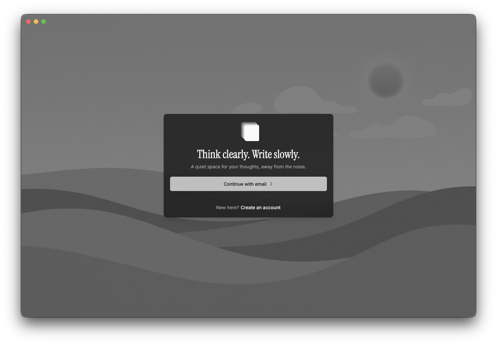

# nota.app

## Philosophy

You know the feeling: you open something to think, and the software starts performing (offering, suggesting, nudging) until the room for your own pace shrinks. Useful automation has its place elsewhere; in a notes app, that itch to always *do something next* can mistake motion for thinking.

nota.app treats your attention as something to **protect**, not to harvest. It gives you a steady place to write and arrange ideas, and it steps back when you pause so your mind can do the unglamorous part: wandering, revising, waiting for the right phrase without the product trying to entertain the lull.

We leave silence alone on purpose. Boredom at the cursor is the sound of a thought catching up.

## What it is



nota.app is a personal notes app built as an [Nx](https://nx.dev) monorepo. The main web app (`[apps/nota.app](apps/nota.app)`) uses **React Router 7** with SSR, **Vite**, and **React 19**. Notes and auth live on **Supabase** (Postgres and row-level security). The editor is **TipTap** (ProseMirror). An optional **Electron** desktop shell wraps the same app—see `[apps/nota-electron/README.md](apps/nota-electron/README.md)`.

## Requirements

- **Node.js** 20.x (aligned with this repo’s tooling)
- **npm** (workspaces are defined at the repository root)

## Install

From the repository root:

```sh
npm install
```

## Environment

Copy `[apps/nota.app/.env.example](apps/nota.app/.env.example)` to `apps/nota.app/.env` and set:

- `VITE_SUPABASE_URL` — your Supabase project URL
- `VITE_SUPABASE_ANON_KEY` — your Supabase anon (public) key

Schema, RLS policies, and migrations are applied in Supabase from the SQL in this repo (see below)—not from these variables alone.

## Database

SQL migrations live under `[supabase/migrations/](supabase/migrations/)` at the repository root. If you use the [Supabase CLI](https://supabase.com/docs/guides/cli), link your project and apply migrations with your usual workflow (for example `supabase db push` against a linked project, or local `supabase start` for development).

## Run the web app

```sh
npx nx dev nota.app
```

The Vite dev server listens on **[http://localhost:4200](http://localhost:4200)**.

## Build and test

```sh
npx nx build nota.app
npx nx test nota.app
```

Tests use **Vitest** via the Nx Vitest plugin.

## Electron

The desktop app expects the web dev server at `http://localhost:4200`. From the repository root you can run:

- `npm run electron:dev` — Electron only (start the web app in another terminal with `npx nx dev nota.app`)
- `npm run dev:all` — web app and Electron together (uses `concurrently`)

More detail: `[apps/nota-electron/README.md](apps/nota-electron/README.md)`.

## Repository layout


| Path                  | Purpose                                   |
| --------------------- | ----------------------------------------- |
| `apps/nota.app/`      | Main SSR web application                  |
| `apps/nota-electron/` | Electron shell                            |
| `supabase/`           | Supabase config and SQL migrations        |
| `assets/`             | Shared assets (e.g. screenshots for docs) |


## Licence

Apache License 2.0 — see `[LICENSE](LICENSE)` and `[package.json](package.json)`.